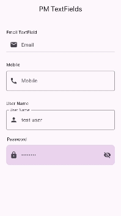

# PM Text Field 

[](https://pub.dev/packages/pm_text_fields)
[](https://github.com/poorveshinexture312/pm_text_fields/blob/main/LICENSE)


PMTextField is a versatile and customizable Flutter widget for text input, designed to give developers enhanced control over the appearance and functionality of text fields in their applications. With PMTextField, you can easily create custom text fields that cater to various use cases, including password inputs, email inputs, phone number inputs, and more.

## Installation 

1. Add the latest version of the package to your pubspec.yaml (and run`dart pub get`):
```yaml
dependencies:
  pm_text_fields: ^0.0.1
```
2. Import the package and use it in your Flutter App.
```dart
import 'package:pm_text_fields/pm_text_fields.dart';
```

## Usage
To use PMTextField in your Flutter app, import the package and create a new PMTextField widget. You can create multiple text fields according to the requirements of your project or your design, with different styling and attributes.




  ```dart
import 'package:flutter/material.dart';
import 'package:pm_text_fields/pm_text_fields.dart';

void main() {
  runApp(const PMApp());
}

class PMApp extends StatelessWidget {
  const PMApp({super.key});

  @override
  Widget build(BuildContext context) {
    return const MaterialApp(
      debugShowCheckedModeBanner: false,
      title: 'PM TextFields',
      home: MyHomePage(title: 'PM TextFields'),
    );
  }
}

class MyHomePage extends StatefulWidget {
  const MyHomePage({super.key, required this.title});

  final String title;

  @override
  State<MyHomePage> createState() => _MyHomePageState();
}

class _MyHomePageState extends State<MyHomePage> {
  final GlobalKey<FormState> _key = GlobalKey<FormState>();

  @override
  Widget build(BuildContext context) {
    return Scaffold(
      appBar: AppBar(

        title: Center(child: Text(widget.title)),
        centerTitle: false,
      ),
      body: Padding(
        padding: const EdgeInsets.all(20),
        child: Form(
          key: _key,
          child: SingleChildScrollView(
            child: Column(
              mainAxisAlignment: MainAxisAlignment.start,
              crossAxisAlignment: CrossAxisAlignment.start,
              children: [
                const SizedBox(
                  height: 16,
                ),
                const Text(
                  "Email TextField",
                ),
                const SizedBox(
                  height: 5,
                ),
                const PMTextField(
                  keyboardType: TextInputType.emailAddress,
                  hint: "Email",
                  textInputAction: TextInputAction.next,
                  prefixIcon: Icon(Icons.email),
                ),
                const SizedBox(
                  height: 30,
                ),
                const Text(
                  "Mobile",
                ),
                const SizedBox(
                  height: 10,
                ),
                PMTextField(
                  keyboardType: TextInputType.phone,
                  hint: "Enter mobile",
                  labelText: "Mobile",
                  theme: FilledOrOutlinedTextTheme(
                    enabledColor: Colors.grey,
                    focusedColor: Colors.purple,
                    fillColor: Colors.transparent,
                  ),
                  textInputAction: TextInputAction.next,
                  prefixIcon: const Icon(Icons.call),
                ),
                const SizedBox(
                  height: 30,
                ),
                const Text(
                  "User Name",
                ),
                const SizedBox(
                  height: 10,
                ),
                PMTextField(
                  keyboardType: TextInputType.text,
                  hint: "User Name",
                  labelText: "User Name",
                  theme: FilledOrOutlinedTextTheme(
                    enabledColor: Colors.grey,
                    focusedColor: Colors.purple,
                    fillColor: Colors.transparent,
                  ),
                  textInputAction: TextInputAction.next,
                  prefixIcon: const Icon(Icons.person),
                ),
                const SizedBox(
                  height: 20,
                ),
                PMTitleTextField(
                  title: 'Password',
                  textField: PMTextField(
                    keyboardType: TextInputType.emailAddress,
                    hint: 'Password',
                    textInputAction: TextInputAction.done,
                    obscureText: true,
                    theme: FilledOrOutlinedTextTheme(
                      fillColor: Colors.purple.withAlpha(50),
                      radius: 10,
                    ),
                    prefixIcon: const Icon(Icons.lock),
                    suffixIcon: const Icon(Icons.visibility_off),
                  ),
                ),
                const SizedBox(
                  height: 20,
                ),
              ],
            ),
          ),
        ),
      ),
    );
  }
}

```

## Author
PM Coding

## Contributing 
Contributions, issues, and feature requests are welcome! 

## Show your Support 
Give a star if this project helped you. 

## Copyright & License
Code copyright 2024-2025
Code released under the [MIT license](https://github.com/poorveshinexture312/pm_text_fields/blob/main/LICENSE).
